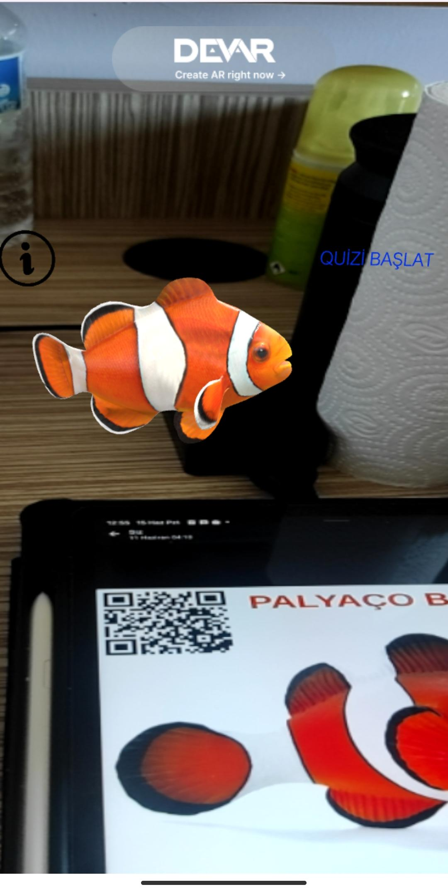
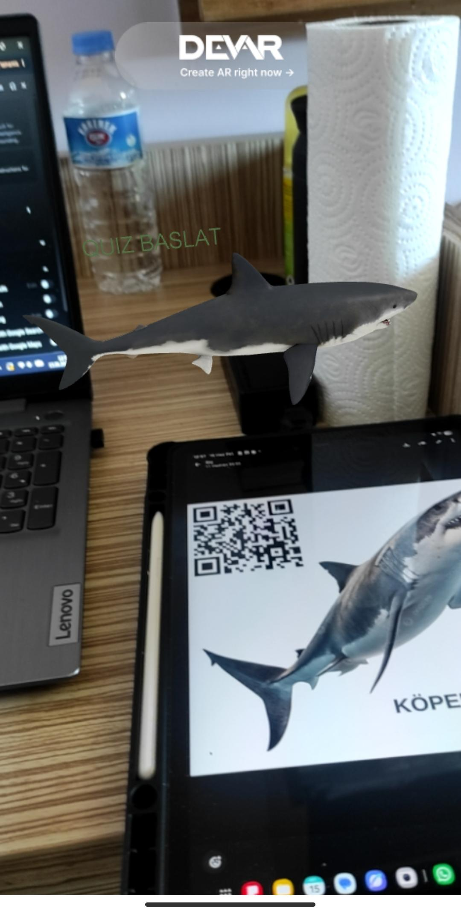
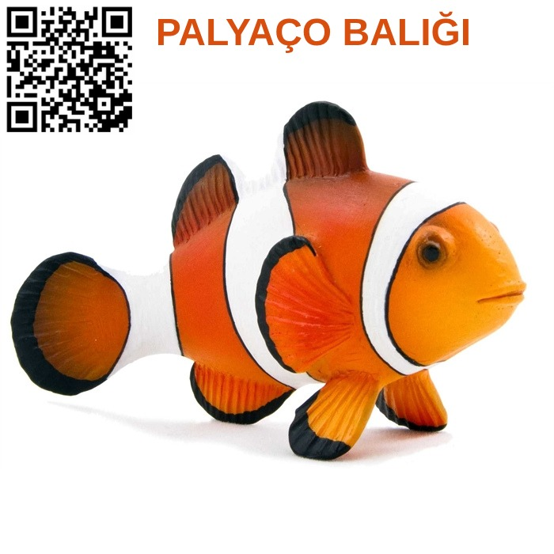
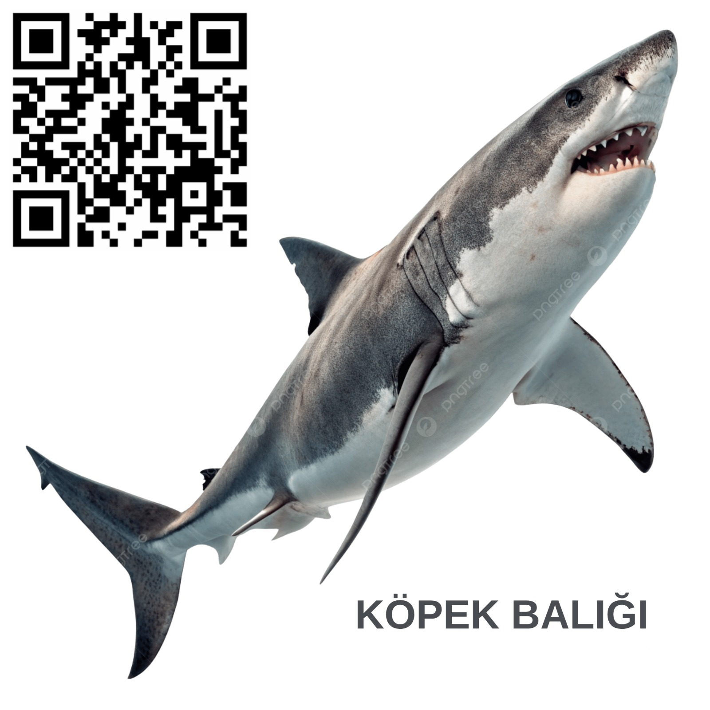

# 🐠 Artırılmış Gerçeklik (AR) Balık Müzesi Projesi

Bu proje, deniz canlılarını interaktif bir şekilde tanıtmak amacıyla hazırlanmış bir **WebAR (Web Tabanlı Artırılmış Gerçeklik)** müzesidir. Kullanıcılar, herhangi bir uygulama indirmeden sadece QR kodları taratarak balıkları 3 boyutlu görebilir, sesli anlatımlarını dinleyebilir ve interaktif testlere katılabilirler.

## 🚀 Proje Bağlantıları
- **Palyaço Balığı Deneyimi:** [https://mywebar.com/p/Project_0_ph1x6jr5iy]
- **Köpekbalığı Deneyimi:** [https://mywebar.com/p/Project_0_ph1x6jr5iy]

## ✨ Öne Çıkan Özellikler
- **3D Canlandırma:** Gerçekçi ve animasyonlu balık modelleri.
- **Sesli Rehber:** Yapay zeka (AI) tarafından seslendirilmiş, balığın ağzından anlatılan bilgilendirici metinler.
- **İnteraktif Bilgi Kartları:** AR ortamında bulunan "i" butonlarına tıklandığında açılan gizli bilgi panelleri.
- **Eğitici Quiz Entegrasyonu:** Her balık için özel olarak hazırlanmış, öğrenmeyi ölçen Google Forms tabanlı testler.
- **Erişilebilirlik:** QR kod teknolojisi sayesinde kurulum gerektirmeyen, tarayıcı tabanlı hızlı erişim.

## 🛠️ Kullanılan Teknolojiler
- **AR Platformu:** [MyWebAR](https://mywebar.com/)
- **3D Modeller:** GLB Format (Sketchfab & Quaternius)
- **Seslendirme:** ElevenLabs / Clipchamp AI Text-to-Speech
- **Etkileşim:** JavaScript tabanlı Action tetikleyicileri
- **Test Sistemi:** Google Forms

## 📖 Nasıl Deneyimlenir?
1. Akıllı telefonunuzun kamerasını açın.
2. Proje klasöründe bulunan ilgili balığın **QR kodunu** taratın.
3. Kamera iznini onaylayın.
4. Balık canlandığında ekrandaki butonlarla etkileşime geçin:
   - **Konuşmayı dinleyin.**
   - **"i" butonuna basarak** ekstra bilgileri okuyun.
   - **"Quiz" butonuna basarak** kendinizi test edin.

### 📸 Proje Canlı Görünümü (Demo)
*Uygulamanın telefon ekranındaki görüntüsü:*

---

### 🖼️ Müze Sergi Kartları (QR Kodlar)
*Deneyimlemek için aşağıdaki görselleri telefonunuzla taratın:*

| 🐠 Palyaço Balığı Kartı | 🦈 Köpekbalığı Kartı |
| :---: | :---: |
|  |  |

---
*Bu proje Yazılım Mühendisliği Güncel Konular kapsamında 220541088 nolu öğrenci Helin Korkutata tarafından geliştirilmiştir.*
